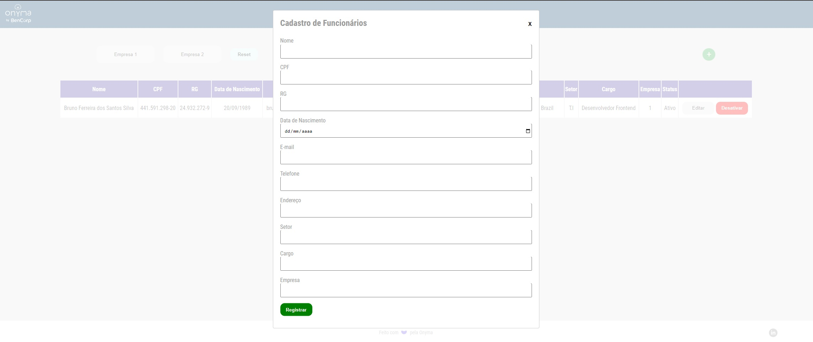

# Teste De Frontend para empresa BenCorp
> Está aplicação foi criada para fins de avaliação do meu trabalho profissional


## Instalação

```sh
npm install
yarn install
```

## Execut

```sh
npm run dev
yarn dev
```
## Backend da Aplicação

O backend da aplicação foi criado separado para fins de estudo e se encontra 
no link abaixo:

1. Faça o clone do projeto (<https://github.com/BrunoGoudric/backend-teste-frontend>)
2. Faça a instalação dos pacotes, como no exemplo abaixo:

```sh
npm install
yarn install
```
3. Execute o projeto

```sh
npm run dev
yarn dev
```
## Tela Inicial


1. Aqui temos 4 botões na parte superior;
2. O primeiro da esquesda para a direita filtra todos os funcionários da empresa 1
3. O segundo da esquesda para a direita filtra todos os funcionários da empresa 2
4. O terceiro da esquesda para a direita faz um reset dos filtros aplicados
5. O ultimo botão abre um modal para Cadastrar Novos Funcionários
6. Abaixo temos a lista de funcionários e dois botões de ação na ultima coluna
7. Primeiro botão faz a edição dos dados cadastrados
8. Segundo botão "Desativa" e "Ativa" o funcionário


## Cadastro de Funcionário



1. Nesse modal é possível realizar o registro do novo funcionário
2. Não pode cadastrar 2 funcionários com o mesmo CPF;
3. Ao Cadastrar você é obrigado a informar ou o Email ou o Telefone
4. É preciso informar a Empresa que o funcionário trabalha através do número 1 ou 2
5. É necessário atorizar a localização do browser quando solicitado conforme imagem abaixo:


6. Ao fazer o procedimento acima a API GeoLocalização vai conseguir preencher o endereço sozinho do formulário de Registro

## Edição de Dados do Funcionário


1. Nessa parte é possível realizar a atualização dos dados do funcionário

## Alterando Status do Funcionário


1. Ao realizar a desativação do funcionário o botão é modificado e permitir caso tenha tenha necessidade realizar a Ativação novamente